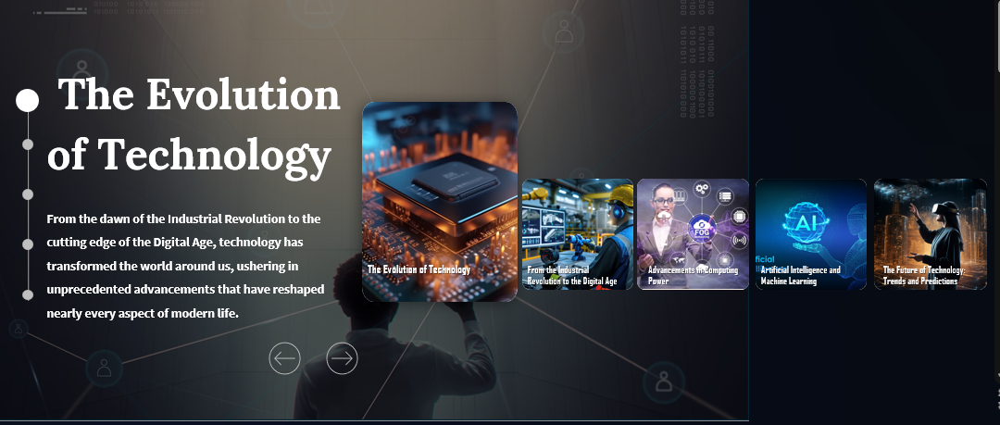
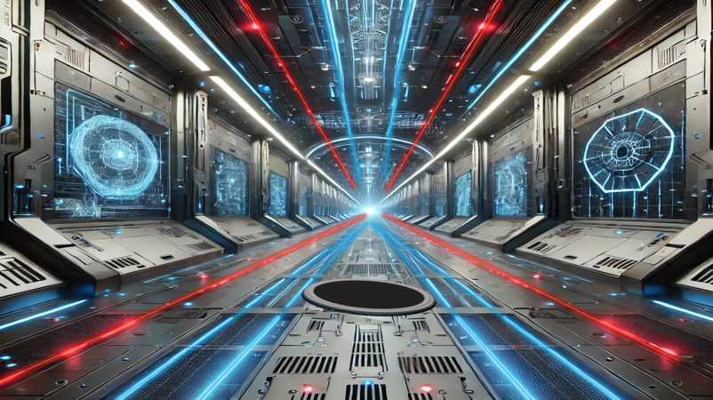

# Technology Presentation – Modern, Visual & Interactive

🎯 **About the Project**  
This PowerPoint presentation explores the evolution and impact of modern technology in an engaging and dynamic way. What sets this presentation apart is its **design philosophy**: the presentation **uses technology to explain technology**.

🧠 **What Makes It Unique?**
- ⚡ Animated transitions to reflect digital speed and evolution
- 🧩 Modular slide structure to simulate "apps" or "dashboards"
- 🌐 Thematic consistency (dark mode, tech-style fonts, neon highlights)
- 🎮 Interactivity via clickable elements (simulating UX/UI experience)

📂 **Included File**
- `technology_presentation.pptx`: The full presentation file
- (Technology-Presentation.pptx)
- (Technology-Presentation-idea-2.pptx)
🖼️ **Preview**

📝 **Usage**
This file is ideal for use in:
- Educational sessions
- Tech awareness programs
- Visual storytelling about digital transformation

💡 **Note**
This is not a generic slideshow. It reflects **how we should present tech: fast, clean, immersive**.
